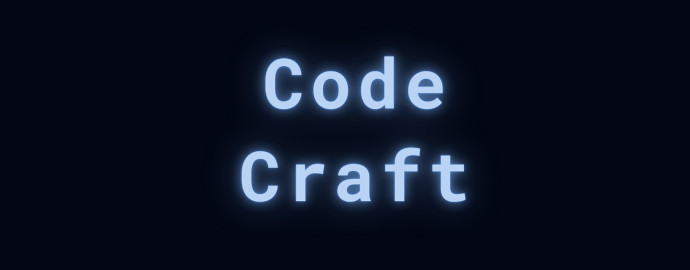
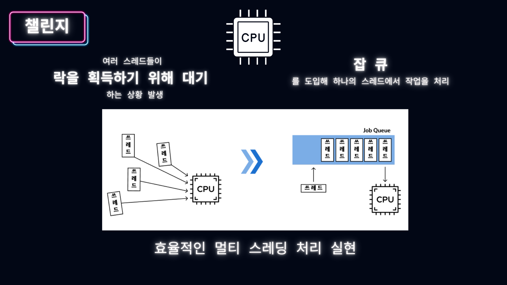
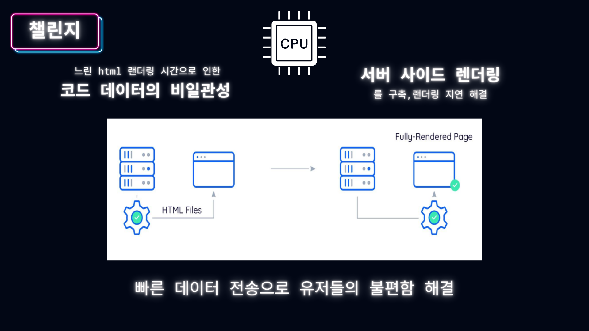
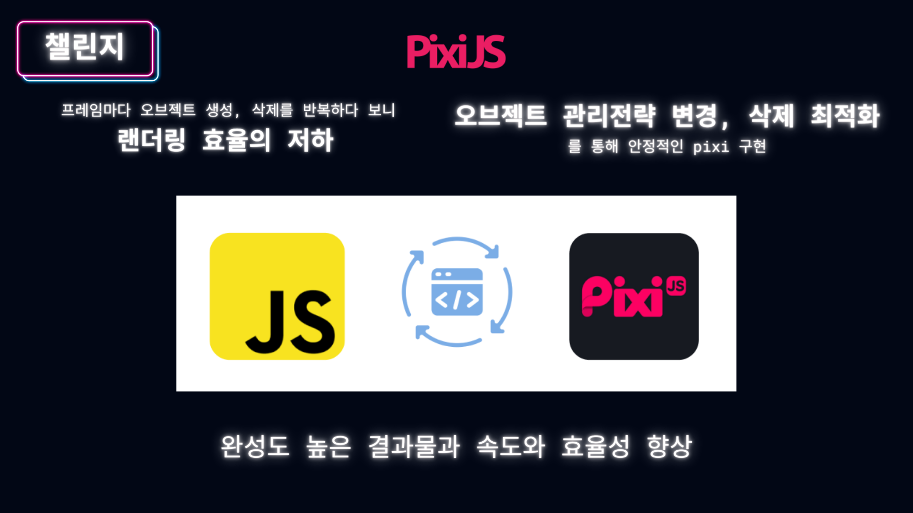
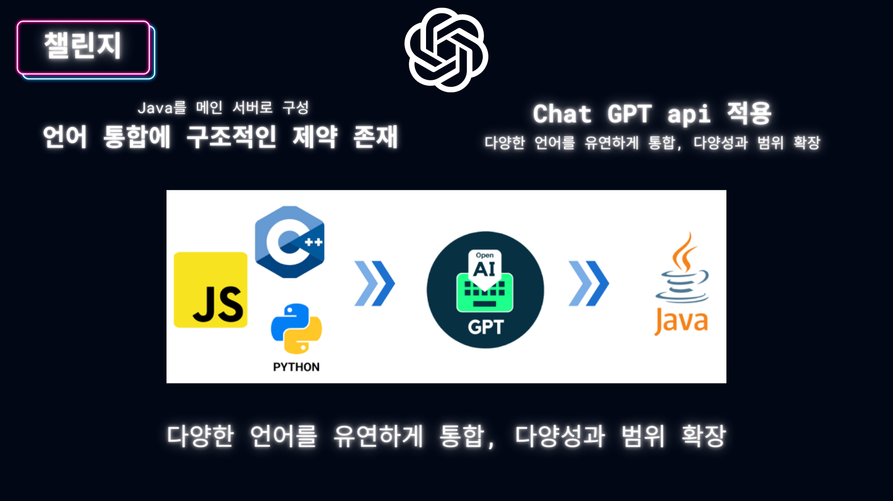
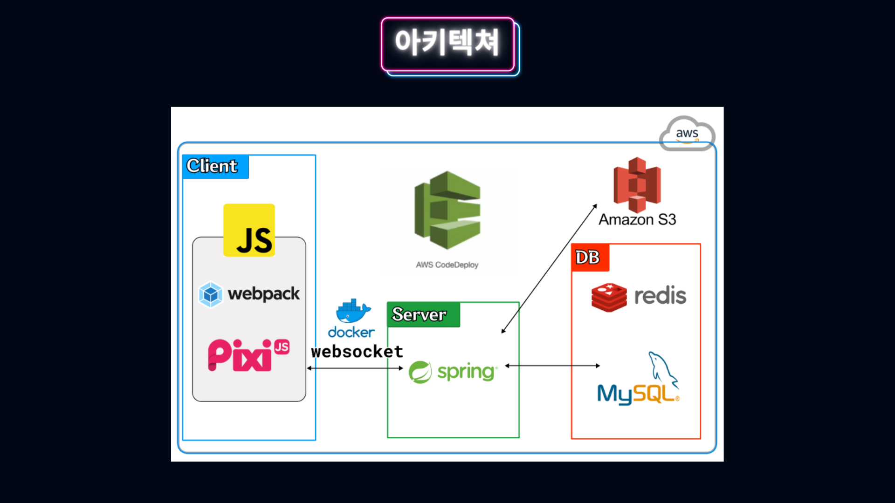
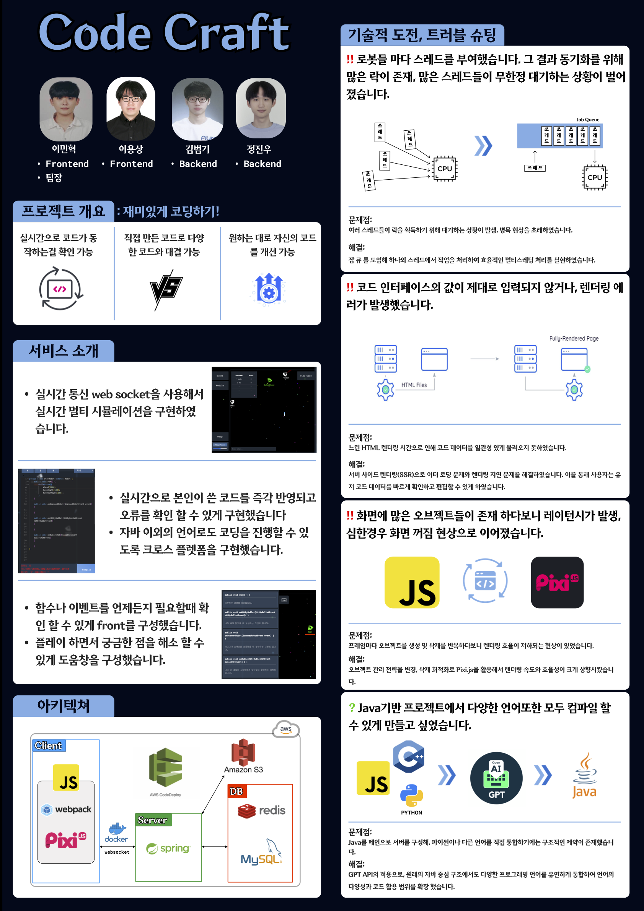

<p align='center'>

</p>

<br/>

## 프로젝트 기간

### 2023.06.29 ~ 2023.08.12
- [0주차] 팀 형성 및 아이디어 브레인 스토밍 (6.29 ~ 7.06)
- [1주차] Multi NLP라는 게임을 구체화 (7.07 ~ 7.13)
- [2주차] 게임 서버 구축 및 기본적인 틀  (7.07 ~ 7.14)
- [3주차] 음성 입력 기능 추가 (7.14 ~ 7.26)
- [4주차] CodeCraft 라는 아이디어로 다시 시작(7.27 ~ 8.04)
- [5주차] 노래 삽입 및 폴리싱(8.05 ~ 8.12)

<br/>

## 서비스 소개

### 기획 배경
개발이 핫한 요즘 어떻게 하면 사람들이 코딩에 대해 조금 더 쉽게 접근 할 수 있고 흥미를 유도
### 서비스 특징
- 코드 수정에 따른 실시간 로봇 업데이트 
- 실시간 멀티플레이
- 채팅 기능
### 관련 링크
- http://codecraft.world
- https://youtu.be/OD0XJlWmRVs

<br/>

## 기술 스택
- Web
    - frontend
        <p align="left">
        
        
        
        <p>
    - backend
        <p align="left">
        
        
        </p>
    - Database
        <p align="left">
        
        </p>
    - Server
        <p align="left">
        
        
        </p>

    - Version Control
        <p align="left">
        
        
        </p>

    - Idle
        <p align="left">
        
         
        </p>  

    - Etc
        <p align="left">
        
        
        
        </p>

<br/>

## 핵심 기능

<p align='center'>

</p>
- 설명

<p align='center'>

</p>
- 설명

<p align='center'>

</p>
- 설명

<p align='center'>

</p>
- 설명

<br/>

## 아키텍처

<p align='center'>

</p>

<br/>

## 포스터

<p align='center'>

</p>


## 개발환경 셋팅 (플레이 하는법!)
```bash
# git clone
$ git clone https://github.com/krafton-codeCraft/code-craft.git
# install npm
$ brew install npm
# java
brew install openjdk@17
```
### 실행 방법
```bash
chmod +x startlocal.sh
./startlocal.sh
```
