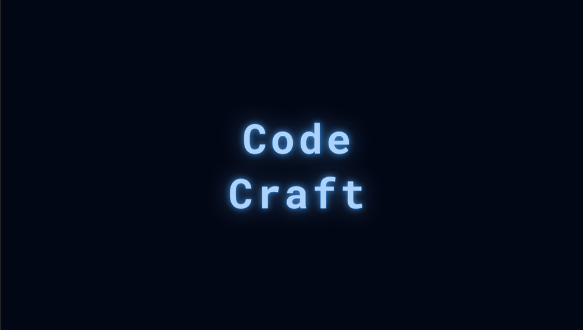

<p align='center'>

</p>

## 프로젝트 기간

## 서비스 소개

## 아키텍처 & 기술스택

## 주요 기술 스택
- Web
    - frontend
        <p align="left">
        
        
        
        <p>
    - backend
        <p align="left">
        
        
        </p>
    - Database
        <p align="left">
        
        </p>
    - Server
        <p align="left">
        
        
        </p>

    - Version Control
        <p align="left">
        
        
        </p>

    - Idle
        <p align="left">
        
         
        </p>  

    - Etc
        <p align="left">
        
        
        
        </p>


## 프로젝트 진행

## 프로젝트 결과

## 개발 환경
AWS ec2

### 개발환경 셋팅
```bash
# git clone
$ git clone https://github.com/krafton-codeCraft/code-craft.git
# install npm
$ brew install npm
# java
brew install openjdk@17
```
### 실행 방법
```bash
chmod +x startlocal.sh
./startlocal.sh
```
